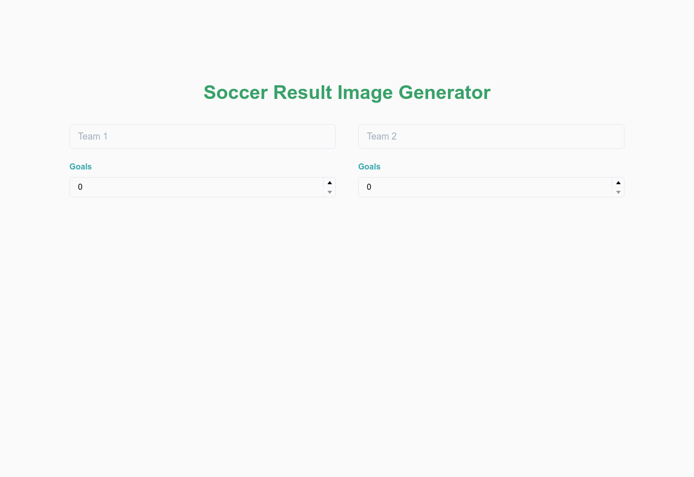

<p align="center">
   
</p>

<h1 align="center">Soccer Result Generator</h1>

<p align="center">	
   <a href="https://www.linkedin.com/in/rafael-goulartb/">
      
   </a> 
  

  
  <a href="https://github.com/RafaelGoulartB/soccer-result-generator#readme">
    
  </a>
   <a href="https://github.com/RafaelGoulartB/soccer-result-generator/commits/master">
      
  </a> 
  
   <a href="https://github.com/RafaelGoulartB/soccer-result-generator/stargazers">
      
   </a>
</p>

> ⚽ Soccer Result Image Maker. Made using Next.js Serveless Functions.

<div align="center">
  <sub>The Soccer Reuslt Generator project. Built with ❤︎ by
    <a href="https://github.com/RafaelGoulartB">Rafael Goulart</a> and
    <a href="https://github.com/RafaelGoulartB/soccer-result-generator/graphs/contributors">
      contributors
    </a>
  </sub>
</div>


# :pushpin: Table of Contents

- [Technologies](#computer-technologies)
- [Features](#rocket-features)
- [How to run](#construction_worker-how-to-run)
- [Issues](#bug-issues)
- [Contributing](#tada-contributing)
- [License](#closed_book-license)

<div align="center">
  
</div>

# :computer: Technologies
This project was made using the follow technologies:

* [Next.js](https://nextjs.org/)        
* [Vercel](https://vercel.com/)     

# :rocket: Features

* Generate Images with soccer games results.

# :construction_worker: How to run
### Rename env file
Rename `.env-exemple` to `.env`
### Install Dependencies
```bash
yarn install
```
### Run Aplication
```bash 
yarn dev 
```

Open [http://localhost:3000](http://localhost:3000) with your browser to see the result.
<br>

# :bug: Issues

Feel free to **file a new issue** with a respective title and description on the the [Soccer Result Generator](https://github.com/RafaelGoulartB/soccer-result-generator/issues) repository. If you already found a solution to your problem, **i would love to review your pull request**!

# :tada: Contributing
First of all, thank you for being interested in helping out, your time is always appreciated in every way. :100:

Here's some tips:

* Check the [issues page](https://github.com/RafaelGoulartB/soccer-result-generator/issues) for already opened issues (or maybe even closed ones) that might already address your question/bug/feature request.
* Feature requests are welcomed! Provide some details on why it would be helpful for you and others, explain how you're using bull-board and if possible even some screenshots if you are willing to mock something!

Check out the [contributing](./CONTRIBUTING.md) page to see the best places to file issues, start discussions and begin contributing.

# :closed_book: License

Released in 2020 :closed_book: License

Made with love by [Rafael Goulart](https://github.com/RafaelGoulartB) 🚀.
This project is under the [MIT license](./LICENSE).


Give a ⭐️ if this project helped you!
